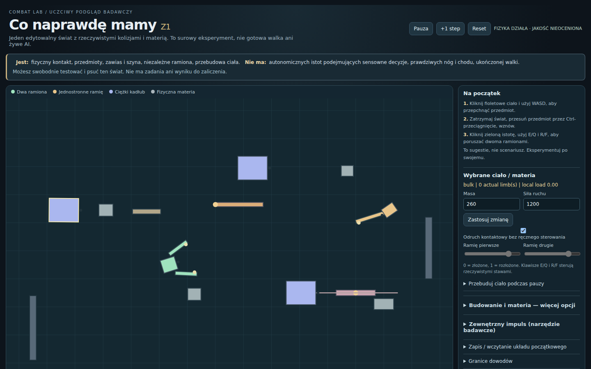

# Combat Lab — Owner First Look (nieopublikowany podgląd)

Ta gałąź jest **prezentacją rzeczywistego eksperymentu Z1**, nie nowym „Combat Lab 1.0”. Kod fizyczny, scena i testy pochodzą dokładnie z `experiment/contact-only-relations-z1@f2d71e63277bfe77aa299c5d5b153143e82217ac`. Zmieniono przede wszystkim pierwsze wrażenie i ergonomię: polskie objaśnienia, jasne granice, schowanie dodatkowych paneli, usunięcie nieosiągalnej obsługi nieaktywnego chwytu oraz test realnego UI. Nie zmieniono celowo fizycznych praw świata.

**Działa:** ręczne sterowanie ciałem, siłowy kontakt z materią, zawias i suwak, rzeczywiste ramiona, pauza/edytowanie ciała, reset, zapisywanie układu. **Nie działa:** autonomiczna inicjatywa istot, rzeczywisty chód, prawdziwe podłoże, bogaty tłum, gotowy combat.

**CI ≠ Owner PASS.** Każda próba Ownera może ten kierunek obalić. Gałąź NIE JEST wdrożona do Pages, nie zastępuje publicznego `rehearsal/current`. Gdy ktoś wyrazi zgodę na publiczne GitHub Pages, istniejący workflow `pages.yml` umie opublikować konkretny SHA, ale będzie to publiczne i nadpisze neutralny obecny test. Nie robić tego automatycznie.

## Rzeczywisty pierwszy ekran

Źródło obrazu: [Chromium CI 38078372343](https://github.com/Jozzpoly/Combat-Lab/actions/runs/38078372343), commit `db1b43fa1695930c391ce1f5a21da592686dfcd5`. Obraz nie jest obietnicą produktu; późniejsze naprawy etykiet/testu nie zmieniają tego, co wynika z fizyki.
